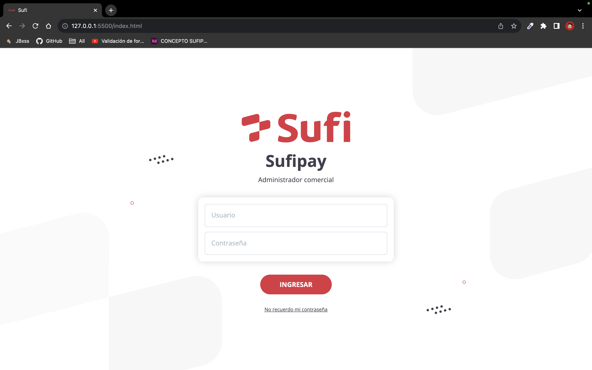
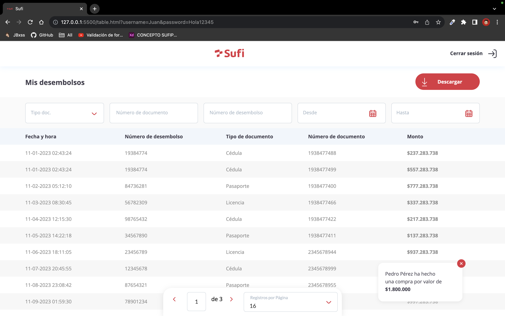
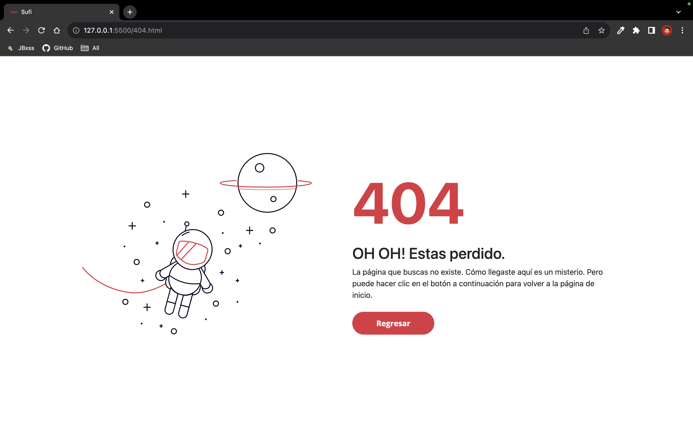

**SUFI: Administrador Comercial**

### Descripción
SUFI es un sistema de administración comercial que proporciona funcionalidades para gestionar datos y realizar operaciones relacionadas con desembolsos. El sistema incluye un módulo de autenticación, una página de tabla con filtros funcionales y paginación, así como una página de error 404 para manejar rutas no encontradas.

### Capturas de Pantalla

*Pagina de Login de Sufi*

*Pagina de Desembolsos de Sufi*

*Vista de Error404*

### Características Principales
1. **Autenticación y Validaciones**
   - Inicio de sesión con validaciones de usuario y contraseña.
   - Animaciones interactivas para mejorar la experiencia del usuario.

2. **Página de Tabla**
   - Visualización de datos en forma de tabla con capacidad de filtrado.
   - Filtros funcionales para buscar información específica.
   - Paginación para facilitar la navegación a través de conjuntos de datos extensos.
   - Exportación de datos a un archivo CSV para su posterior análisis.

3. **Error 404**
   - Página personalizada para manejar rutas no encontradas.
   - Mejora la usabilidad al proporcionar una respuesta clara y amigable.

### Estructura del Proyecto
- **index.html**: Página principal que contiene la interfaz de inicio de sesión y el enlace a la página de tabla.
- **tabla.html**: Página que muestra una tabla con datos filtrables y paginación.
- **error404.html**: Página de error personalizada para rutas no encontradas.
- **Carpeta: css**: Hojas de estilos que definen la apariencia y animaciones del sistema.
- **Carpeta: js**: Archivos JavaScript que gestiona la lógica de filtrado, validaciones, animaciones, paginación y exportación de datos.

### Cómo Usar
1. Abre el archivo `index.html` en un navegador web para acceder a la página de inicio de sesión.
2. Ingresa las credenciales de usuario para acceder al sistema. _// Usuario: Cualquiera con mas de 4 Caracteres | Contraseña: Cualquiera con mas de 8 caracteres como minimo minuscula, mayuscula y numero_
3. Navega a la página de tabla para visualizar y filtrar datos.
4. Utiliza la paginación para explorar conjuntos extensos de datos.
5. Exporta datos a un archivo CSV haciendo clic en el botón correspondiente.
6. En caso de rutas no encontradas, serás redirigido a la página de error 404.

### Tecnologías Utilizadas
- HTML5
- CSS3
- JavaScript

### Créditos
Este proyecto fue desarrollado como parte de una prueba tecnica utilizando tecnologías web estándar, hecho por Juan Bossa.
